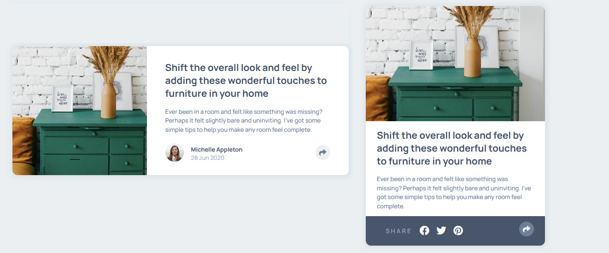

# Article preview component solution

This is a solution to the [Article preview component challenge on Frontend Mentor](https://www.frontendmentor.io/challenges/article-preview-component-dYBN_pYFT). 

## Overview

### The challenge

This challenge was good to train my skills in designing responsive layouts using media query, and also DOM manipulation with Javascript. I think the final result was very good, encompassing all possible cases.

### Screenshot

### Links

- Live Site URL: [Add live site URL here](https://your-live-site-url.com)
